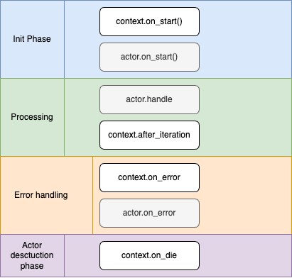

# uActor
## Overview
The fastest and most modular actor system that doesn’t force you to pay for what you don’t need

## Examples
Examples can be found [here](src/uactor/examples).

### Features
1. Simplified creation of a tokio actor topic oriented actor
2. Minimum boilerplate code
3. Support different tokio channels including `watch`, `broadcast`, `oneshot`, `mpsc`.
4. Each actor is able to listen up to 30 channels.
5. Added support of actors with single real channel and routing messages to the defined handler  
[Example: Single channel](src/uactor/examples/single_channel_actor.rs)
6. Added tick (actor call each n seconds/millis/etc) support  
[Example: Interval](src%2Fuactor%2Fexamples%2Finterval.rs)
7. Implemented Dependency Injection on pre-start stage to solve cross-references problem ("Actor#1" needs a reference to the "Actor#2", and "Actor#2" needs a reference to "Actor#1")  
[Example: dependency injection](src/uactor/examples/dependency_injection.rs)
8. Integration with tokio/tracing, including tracing of actor lifecycle, messages, and handlers
9. Implemented support for actors for which it is necessary to work with multiple message sources (channels) [Example: Multi channel](./src/uactor/examples/multiple_incoming_channels.rs)
10. Implemented shared state for actors [Example: Shared state](./src/uactor/examples/shared_state.rs) 

### Actor lifecycle

### Other projects:
1. Actix
2. Ractor
3. Tokactor
4. tiny-tokio-actor

## License

This project is licensed under the [MIT license](LICENSE).

### Contribution

Unless you explicitly state otherwise, any contribution intentionally submitted
for inclusion in uActor by you, shall be licensed as MIT, without any additional
terms or conditions.