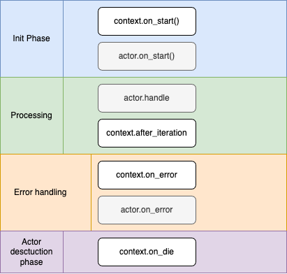

# uActor

## Overview

The fastest and most modular actor system that doesn't force you to pay for what you don't need.

## Quick Start

Define messages with `#[derive(Message)]`, implement handlers with `#[uactor::actor]` / `#[uactor::handler]`:

```rust
#[derive(uactor::Message)]
struct Increment;

#[derive(uactor::Message, Debug)]
struct GetCount(Reply<CountResponse>);

struct CounterActor { count: u32 }

impl Actor for CounterActor {
    type Context = Context;
    type RouteMessage = CounterActorMsg;
    type Inject = ();
    type State = ();
}

#[uactor::actor]
impl CounterActor {
    #[uactor::handler]
    async fn handle_increment(&mut self, _msg: Increment) -> HandleResult {
        self.count += 1;
        Ok(())
    }

    #[uactor::handler]
    async fn handle_get(&self, GetCount(reply): GetCount) -> HandleResult {
        let _ = reply.send(CountResponse(self.count));
        Ok(())
    }
}

uactor::generate_actor_ref!(CounterActor, { Increment, GetCount });
```

See the full runnable version: [Example: Macro handlers](src/uactor/examples/macro_handlers.rs)

## Examples

Examples can be found [here](src/uactor/examples).

## Features

1. Simplified creation of tokio-based topic-oriented actors
2. Minimum boilerplate code
3. Support for different tokio channels including `watch`, `broadcast`, `oneshot`, `mpsc`
4. Each actor is able to listen up to 30 channels
5. Single channel routing with `generate_actor_ref!`
   [Example: Single channel](src/uactor/examples/single_channel_actor.rs)
6. Tick support (actor called each n seconds/millis/etc)
   [Example: Interval](src/uactor/examples/interval.rs)
7. Dependency Injection on pre-start stage to solve cross-references ("Actor#1" needs "Actor#2" and vice versa)
   [Example: Dependency injection](src/uactor/examples/dependency_injection.rs)
8. Integration with tokio/tracing, including tracing of actor lifecycle, messages, and handlers
9. Multiple message sources (channels) per actor
   [Example: Multi channel](src/uactor/examples/multiple_incoming_channels.rs)
10. Shared state for actors
    [Example: Shared state](src/uactor/examples/shared_state.rs)

### Derive and macro support

- **`#[derive(Message)]`** -- implement the `Message` trait without boilerplate.
  Also available as `message_impl!(MsgA, MsgB)` for multiple types at once.

- **`#[uactor::actor]` + `#[uactor::handler]`** -- define message handlers as simple methods
  instead of manual `impl Handler<M>` for each message type.

  Handler parameters:
  - First parameter (after optional `&mut self` / `&self`) -- the message; its type determines `Handler<Type>`
  - `ctx` -- maps to `&mut Self::Context`
  - `state` -- maps to `&Self::State`
  - Any other parameter -- accessed as a field from the `Inject` struct by name

- **`generate_actor_ref!` with aliased variants** -- map primitive or external types
  to named enum variants:
  ```rust
  uactor::generate_actor_ref!(MyActor, { PingMsg, NextId: i32, Label: String });
  // Generates: enum MyActorMsg { PingMsg(PingMsg), NextId(i32), Label(String) }
  ```

  [Example: Macro handlers](src/uactor/examples/macro_handlers.rs)

### Actor lifecycle



### Other projects

1. Actix
2. Ractor
3. Tokactor
4. tiny-tokio-actor

## License

This project is licensed under the [MIT license](LICENSE).

### Contribution

Unless you explicitly state otherwise, any contribution intentionally submitted
for inclusion in uActor by you, shall be licensed as MIT, without any additional
terms or conditions.
